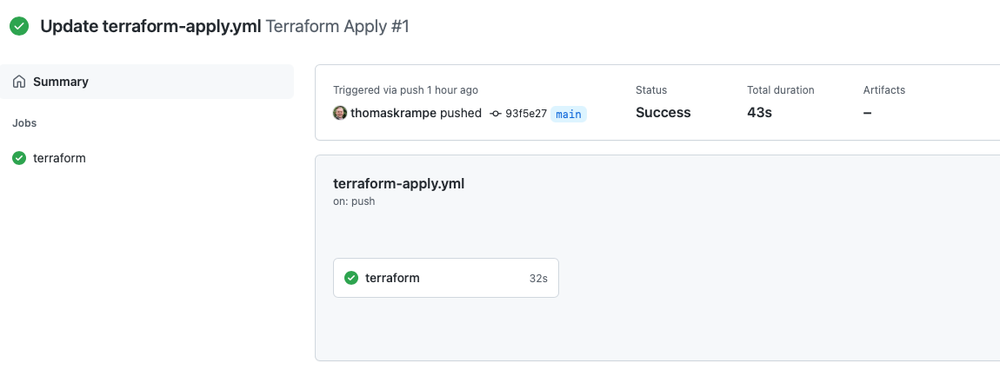

# Terrafrom on Azure using GitHub Actions
[](https://github.com/thomaskrampe/TFonAzure/actions/workflows/terraform-plan.yml)
[](https://github.com/thomaskrampe/TFonAzure/actions/workflows/terraform-apply.yml)
# Prequisites
## GitHub Reporitory
Create a new GitHub repo for Terraform configuration files (or use an existing repo if you already have one).

If creating a new repository, check the Add .gitignore option and select the Terraform template.


If using an existing repo, update your `.gitignore` file using the [GitHub’s Terraform .gitignore template][1].

Clone the GitHub repo to your local machine.

## Azure CLI
Download and install the Azure CLI.

Authenticate with Azure using the `az login` command.

If you have access to multiple Azure subscriptions, select a specific one by running` az account set -s <subscription-id>`.

You can see the list of subscriptions you have access to by running `az account list -o table`.
### Azure service principal
You need to create an Azure service principal to run Terraform in GitHub Actions.

Run the following command to create the service principal and grant it Contributor access to the Azure subscription.

```language-hcl
az ad sp create-for-rbac --name "sp-azure-tf" --role Contributor --scopes /subscriptions/<subscription-id> --sdk-auth
```

**Save the output of the command, you won't be able to view it again***. You’ll need this information later in the process.

For more information, please refer to [Authenticating using a Service Principal with a Client Secret][2] in Terraform docs.
### Terraform
[Download Terraform][3] and ensure it’s in your system’s PATH.

Create a Terraform backend storage account and container.

```language-hcl
az group create -g rg-azure-tf -l westeurope

az storage account create -n tfstate4711 -g rg-azure-tf -l westeurope --sku Standard_LRS

az storage container create -n tfstate --account-name tfstate4711
```
## Terraform configuration

Create a new file main.tf in the Git repo.

```language-hcl
provider "azurerm" {
  features {}
}

terraform {
  backend "azurerm" {
    resource_group_name  = "rg-azure-tf"
    storage_account_name = "tfstate4711"
    container_name       = "tfstate"
    key                  = "azure-tf.terraform.tfstate"
  }
}

resource "azurerm_resource_group" "rg-azure" {
  name     = "rg-azure"
  location = "westeurope"
}
```

Run `terraform init` to initialize Terraform.

You can now run `terraform plan` and see the execution plan.

This Terraform configuration allows you to test changes locally and review the execution plan before committing the changes to Git.
## GitHub Actions

Create a folder `.github` and a subfolder `workflows` in your Git repo.

Next, we’ll create a couple of workflows based on the [GitHub Actions Workflow YAML][4] section of Terraform documentation.
### Pull request validation workflow
Create a file `terraform-plan.yml` in the workflows subfolder. Replace the <client-id>, <cleint_secret>, <subscription-id> and <tenant-id> with the values from the output of the command executed above. We’ll take care of the variables  later.

```language-yaml
name: Terraform Plan

on:
  pull_request:
    branches: [ main ]

jobs:
  terraform:
    runs-on: ubuntu-latest

    env:
      ARM_CLIENT_ID: ${{secrets.AZURE_AD_CLIENT_ID}}
      ARM_CLIENT_SECRET: ${{secrets.AZURE_AD_CLIENT_SECRET}}
      ARM_SUBSCRIPTION_ID: ${{secrets.AZURE_AD_SUBSCRIPTION_ID}}
      ARM_TENANT_ID: ${{secrets.AZURE_AD_TENANT_ID}}

    steps:
      - uses: actions/checkout@v2

      - name: Setup Terraform
        uses: hashicorp/setup-terraform@v1

      - name: Terraform Init
        run: terraform init

      - name: Terraform Format
        run: terraform fmt -check

      - name: Terraform Plan
        run: terraform plan
```

This workflow will automatically trigger on all pull requests into the master branch and generate Terraform execution plan for the proposed change. The pull request approver can then easily review the change without having to pull the branch and generating the execution plan locally.
### Apply changes on merge
Create another file terraform-apply.yml in the workflows subfolder. Same as before, replace the <client-id>, <client_secret>, <subscription-id> and <tenant-id> with the values.

```language-yaml
name: Terraform Apply

on:
  push:
    branches: [ main ]

jobs:
  terraform:
    runs-on: ubuntu-latest

    env:
      ARM_CLIENT_ID: ${{secrets.AZURE_AD_CLIENT_ID}}
      ARM_CLIENT_SECRET: ${{secrets.AZURE_AD_CLIENT_SECRET}}
      ARM_SUBSCRIPTION_ID: ${{secrets.AZURE_AD_SUBSCRIPTION_ID}}
      ARM_TENANT_ID: ${{secrets.AZURE_AD_TENANT_ID}}

    steps:
      - uses: actions/checkout@v2

      - name: Setup Terraform
        uses: hashicorp/setup-terraform@v1

      - name: Terraform Init
        run: terraform init

      - name: Terraform Apply
        run: terraform apply -auto-approve
```

This workflow will automatically deploy changes merged to the master branch. You’d want to make sure that the master branch is protected and all changes successfully pass the pull request validation before they get merged.
### Create the repository secret
The final step of the GitHub repo configuration is creating the secrets like the AZURE_AD_CLIENT_SECRET secret referenced by the workflows.

Navigate to the repository **Settings** page, then select Secrets in the left nav. Create the new secrets using the secret values from the **Azure service principal** section.


You can learn more about GitHub secrets at [Creating and storing encrypted secrets][5].
## Test the workflow

All pieces are now in place and we can start using the new GitHub Actions workflows.
### Validate changes

Checkout a new branch using git checkout -b <branch-name> and commit your changes.

Publish the branch and create a pull request.

You should see the Terraform Plan workflow kick off automatically after a few seconds.

Click on Details and drilldown into the Terraform Plan step to review the execution plan.
### Apply changes
If you are satisfied with the Terraform plan, merge the pull request.

Navigate to the Actions tab. You should see the Terraform Apply workflow kick off automatically after the merge.

Drilldown into the Terraform Apply logs to verify that the changes were deployed.




[1]: https://github.com/github/gitignore/blob/master/Terraform.gitignore
[2]: https://www.terraform.io/docs/providers/azurerm/guides/service_principal_client_secret.html 
[3]: https://www.terraform.io/downloads.html
[4]: https://www.terraform.io/docs/github-actions/setup-terraform.html#github-actions-workflow-yaml
[5]: https://docs.github.com/en/actions/configuring-and-managing-workflows/creating-and-storing-encrypted-secrets